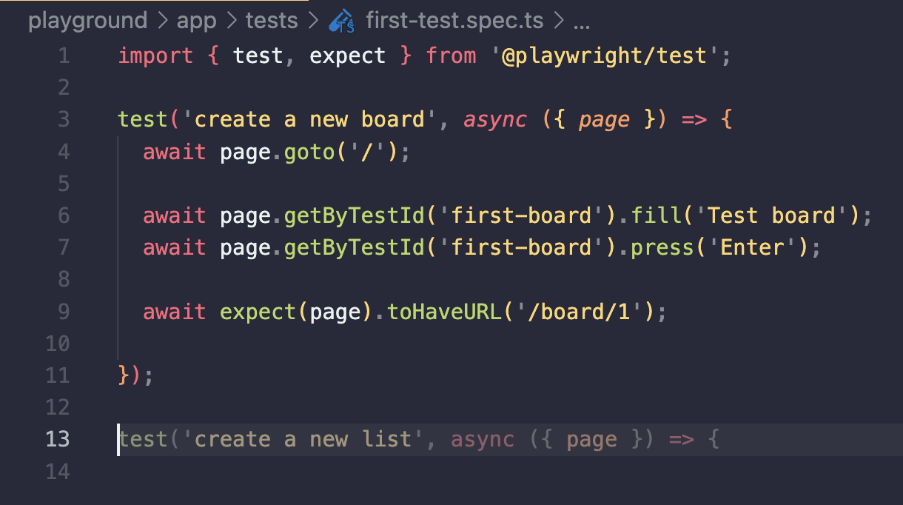
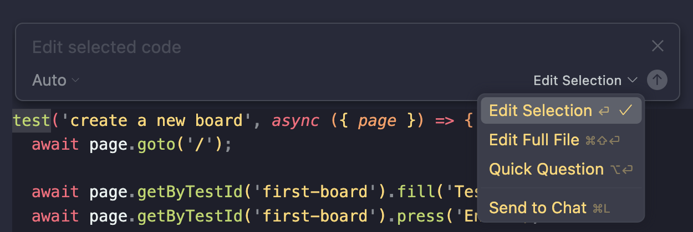

# Cursor basics

## What is Cursor?

- AI-powered code editor
- Originally forked from VS Code
- Context aware
- Customizable
- MCP Support

## Cursor Interface

### Tab completion

Cursor understands the context of the file you are editing and suggests code completions based on the code you are writing.

LLMs are basically a statistical models that are good at predicting what comes next. Very simply put, LLMs are good at predicting what the next word is based on previous context. So once there’s already some content created, Cursor will generally do a good job at pattern recognition.

Because of this, Cursor can be very effective when rewriting code. For example, if your locator is incorrect in your test and it’s present in multiple places, Tab functionality can pick it up very well and make the editing process much easier.

> 💡 Tip: Go to your Cursor Keyboard shortucts and set up a shortcut to toggle the tab completion.

### Agent

The agent is at the core of the Cursor experience. This is where you talk to AI and explain your goals.

You can think of it as ChatGPT but integrated into your IDE. The big advantage of that is that in contrast to ChatGPT, Cursor can understand the context of the code you are writing.

Agent can take various kinds of context. The most basic one is a reference to a file that we are editing.

A.I. follows a certain pattern it can see in the file. But maybe we want to do something slightly different. This a point where adding right context is truly important. A.I. can only work with the assumptions it has. 

### Inline edits

By default, cursor will try its best to look into the parts of the codebase codebase that matter and include them in the context. Inline edits are a great way to point the AI into a focused direction.

Inline edits work really well if you want to:

1. refactor your code
2. get a better understanding of the code that you are looking at.
3. edit only a specific part of the code.

> 💡 Tip: You can use arrow up to go back to the previous message. 

